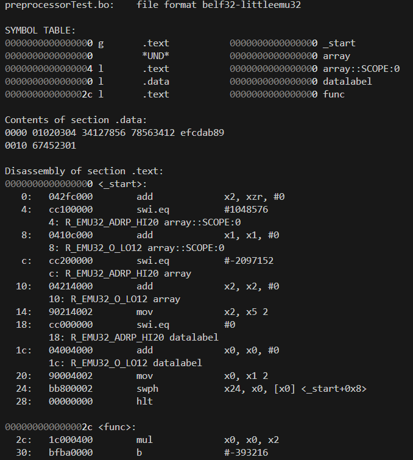
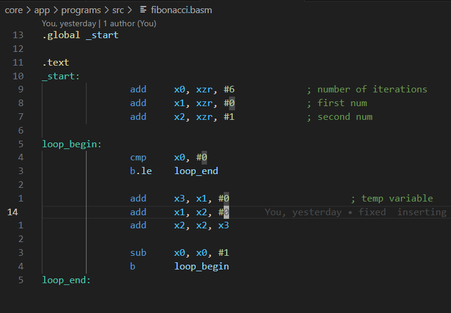

# **32 bit emulator**


## **Table of Contents**
1. [Project Overview](#project-overview)
2. [Features](#features)
3. [Installation](#installation)
4. [How to Run](#how-to-run)
5. [Running Tests](#running-tests)
6. [Usage](#usage)
7. [Documentation](#documentation)
8. [Current Work](#current-work)
9. [Future Goals](#future-goals)
10. [History](#history)
11. [License](#license)

## **Project Overview**
This project simulates a computer processor by simulating the execution of machine-level **ARM-like** instructions. It comes packaged with a preprocessor, assembler, linker, and executable loader to run **basm** assembly code on the emulator. Easily run the build process for custom programs by passing arguments into the `emulator_app` executable, or run an already built `.bexe` directly with the `emu32` command line emulator. Currently working on a C compiler to generate basm assembly, and on the pieces an operating system needs (exceptions, page tables, devices).

* supports up to 64 instructions (6 bit opcode), currently **34** opcodes are in use (30 are free), including hardware floating point (`float` and `double` in the integer registers)
* high **test coverage** to ensure correctness of emulator and assembler (unit and integration tests)
* supports **preprocessors** and **assembler directives** including macro
* privilege levels, exceptions and interrupts, a two level page table MMU, memory mapped devices (timer, console, block device with DMA), and a debugger (trace, breakpoints, watchpoints, a REPL)

<p align="center">
  
  
</p>
<div align="center">
  <strong>Objdump example</strong> (<i>left</i>) and <strong>fibonacci program</strong> (<i>right</i>)
</div>


## **Features**
1. **32 bit emulator**\
&mdash; mostly based off the ARM instruction set, with a few particular changes to simplify\
&mdash; custom bit formats for instructions to achieve a fixed width instruction set (4 bytes)\
&mdash; hardware floating point in the integer registers, atomics, and the instructions a compiler needs (`csel`, `adr`, `clz`, ...)
2. **Assembler**\
&mdash; preprocesses the **source/header** files (`.basm`, `.binc`) into `.bi` files and then converts into **relocatable object** files (`.bo`)\
&mdash; supports some C **preprocessors** like `#include`, `#define`, conditional blocks, and macros\
&mdash; object files are in a custom format that is based off the ELF format (`belf`)\
&mdash; supports a variety of **assembler directives** to help control the assembler process\
&mdash; supports relocatable symbol referencing
3. **Linker**\
&mdash; links all object files, resolving symbols, and creates an **executable file** (`.bexe`)\
&mdash; relocates symbols as needed
4. **Executable loader**\
&mdash; loads a `.bexe` file into the emulator's virtual memory following the section layout from the linker script (by default `.text` at `0x0`, `.data` at `0x1000`, and `.bss` right after `.data`)


## **Installation**
```
# Clone the repo (with the cxxopts submodule)
git clone --recurse-submodules https://github.com/Alientation/32-bit-Emulator.git

# Navigate to the core directory
cd 32-bit-Emulator/core

# If the repo was cloned without submodules
git submodule update --init --recursive

# Ensure CMake (>= 3.15) and Ninja are installed
cmake --version
ninja --version

# Run the build script or CMake to configure and build directly
# Requires a C++20 compiler and Ninja to build (and gcc/gcov, lcov for code coverage)
# GoogleTest is downloaded automatically by CMake
# Builds both build/debug and build/release (and runs the tests)
./build.sh [clean | compile | test | coverage | asan | ubsan]
```


## **How to run**
```
# Ensure project is installed, built, and configure following the Installation steps

# Executables should be located under the corresponding subdirectory in build/debug or build/release
# Examples
build/release/app/emulator_app ...          # build a basm program and run it on the emulator
build/release/assembler/basm ...            # preprocessor + assembler + linker driver
build/release/emulator32bit/emu32 ...       # run a .bexe (or raw ROM) on the emulator
```

The C compiler (`core/ccompiler`) is still in development and is currently disabled in `core/CMakeLists.txt`, so there is no `ccompiler` executable yet.


## **Running Tests**
```
# Tests are automatically ran whenever the build script is executed without arguments.
./build.sh

# Run only the tests (after building)
./build.sh test

# Run a subset of tests with ctest (by name regex or by label: emulator32bit | assembler | assembler_integration)
ctest --test-dir build/debug -R 'ShiftTest.'
ctest --test-dir build/debug -L assembler_integration

# Code Coverage is generated automatically for the debug build. To generate lcov coverage info to display, use the coverage argument.
./build.sh coverage

# Then use the Coverage Gutters and Live Preview extension to view the coverage page.

# Build and test with the address, leak and undefined behavior sanitizers (build/asan), or with the undefined behavior one alone (build/ubsan, faster)
./build.sh asan

# Time the emulator on the programs in tools/bench (see the top of the script)
tools/bench.sh
```
New test files must be added by hand to the `aemu_add_gtest(...)` call in the `tests/CMakeLists.txt` of their module.


## **Usage**
#### Build and run a basm program
To build a specific basm program and run it on the emulator, pass a build argument to the app/emulator_app executable (or to `basm` to only build)\
Note, currently the build process argument parser is extremely rudimentary so options that take an argument must have a space in between\
\
*Example:* `-I ./programs/include -o ./programs/build/palindrome ./programs/src/palindrome.basm -outdir ./programs/build`
##### Some useful options
* -o <path>: output file path relative to the current directory, without an extension (output file is an executable `.bexe` unless otherwise specified)
* -outdir <path>: directory where the object files (`.bo`) are stored
* -I <path>: add a directory from where the `#include` preprocessor will search for `.binc` files
* -l <path>: links given library file `.ba` to the rest of the code in the linker phase
* -ar: instead of an executable file output, create a `.ba` library file to link with in the future
* -c: only compile the source files into object files
* -D <flag>: pass a preprocessor flag to the program
* -kp: keep the intermediate preprocessed `.bi` files
* -ld <script.ld>: use a linker script instead of the default layout
* -dump: print a listing of each object file and of the executable
* -W error, -wall: make a warning end the build like an error
##### More options can be found with `-h` or in the source code (`core/assembler/src/build.cpp`)

#### Run an executable with `emu32`
```
# Load a .bexe, start at _start, run at most 1000 instructions and dump the final state
build/release/emulator32bit/emu32 -e prog.bexe -l 1000 --format plain -o state.txt -m 0x1000:16
```
* `-e <file>`: executable to load, `-l <n>`: instruction limit (0 for none)
* `--reg x0=5,sp=0x2000`, `--flags 0b0100`: initial register and NZCV flag state
* `--ram-*`, `--rom-*`, `--disk-*`: memory layout, `--format plain|pretty`, `-o`, `-m`: state dump
* Exit codes: `0` halted, `1` usage/load error, `2` instruction limit reached, `3` fault, `4` stopped at a breakpoint or watchpoint
* Debugging: `--trace`, `--history`, `--break`, `--watch`, `--watch-reg`, `--debug` (see [`docs/debugging.md`](./docs/debugging.md))
* Run with `--help` for all options. A debug build logs a lot (pipe through `grep -v DBG`); the release builds leave the debug and info messages out


## **Documentation**
* [`docs/basm-syntax.md`](./docs/basm-syntax.md): the basm assembly language: expressions, `.equ` constants, labels and symbols (`label + 4`), instructions, directives and the preprocessor
* [`docs/belf-format.md`](./docs/belf-format.md): the BELF binary formats (`.bo`, `.bexe`, `.ba`), relocations and addends, what the linker does, and linker scripts
* [`docs/isa.md`](./docs/isa.md): the instruction set, its encodings, the condition codes and the emulator calls
* [`docs/exceptions.md`](./docs/exceptions.md): privilege levels, system registers, exceptions and the vector table
* [`docs/mmu.md`](./docs/mmu.md): the page tables and the TLB
* [`docs/devices.md`](./docs/devices.md): the memory map, the devices, interrupts and the boot sequence
* [`docs/abi.md`](./docs/abi.md): the calling convention, the data layout and the frame record
* [`docs/debugging.md`](./docs/debugging.md): tracing, breakpoints, watchpoints and the interactive debugger
* [`docs/internals.md`](./docs/internals.md): how the code is put together, the invariants to keep when changing it, and how to measure a change
* [`docs/todo.md`](./docs/todo.md): what is not done yet
* Sample programs are in `core/app/programs/`
* The documentation of the source code is in the headers (`///` comments)

## **Current Work**
* C Compiler (written in C, currently disabled in the build, awaiting a rewrite; see [`docs/todo.md`](./docs/todo.md))
* Improving/modernizing build and test system
* - Added code coverage tools to assist in unit test development
* - Added integration tests that drive `basm` and `emu32` end to end

## **Future Goals**
* Create simple OS with a CLI
* Support dynamically linked libraries
* Simple compiled language (like C, might instead write a LLVM backend)
* System libraries
* File System
* Benchmark the assembler, linker and loader (`tools/bench.sh` only times the emulator)
* Expand testing
* Clean up and HEAVILY refactor code :~)


## **History**
* **(V1 Iteration)** Sep '23 - May '24
  * First iteration of this project (**6502 emulator** and attempted assembler)
  * Ultimately transitioned project to focus on an ARM-like emulator
* **(V2 Iteration)** June '24 - July '24
  * Near MVP for the 32 bit emulator, with most functionality operational
  * Capable of running example/test programs
  * Ironed out bugs with emulator
  * Rudimentary unit tests (partial code coverage)
* **(Optimizations and New Features)** July '24 - August '24
  * Added Disk memory with cache system
  * Added virtual memory - simulated in c++ but planning on porting over to a program ran on the emulator
  * Redesigned new logging system to be more compact and versatile
  * Added simple profiler to assist with optimizing
  * Began documentation process and cleaning up the codebase
  * Optimized emulator achieving a 32x speed up without virtual memory
* **(Kernel Building Blocks)** August '24 - November '24
  * Added simple linker script, planning on expanding capabilities of it (especially once custom defined sections are added to the assembler)
  * Disk memory is now accessed the same way as ram and rom are accessed (to support memory mapped i/o)
* **(Refactor and Clean up)** November '24 - January '25
  * Removed dead code and cleaned up tests
  * Fix some inconsistencies with float operation naming between the emulator and assembler
  * Finally fixed inconsistent file naming (now all lowercase)
  * Started work on implementing a better virtual memory system
*todo*


## **License**
This project is licensed under the MIT License - see the [LICENSE](./LICENSE.md) file for details
