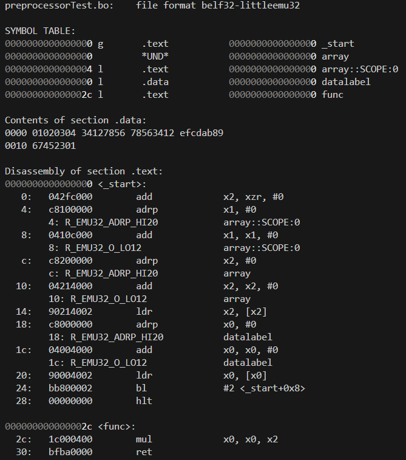

# **32 bit emulator**


## **Table of Contents**
1. [Project Overview](#project-overview)
2. [Features](#features)
3. [Installation](#installation)
4. [How to Run](#how-to-run)
5. [Running Tests](#running-tests)
6. [Usage](#usage)
7. [Documentation](#documentation)
8. [Future Goals](#future-goals)
9. [History](#history)
10. [License](#license)

## **Project Overview**
This project simulates a computer processor by simulating the execution of machine-level **ARM-like** instructions. It comes packaged with a preprocessor, assembler, linker, and executable loader to run **basm** assembly code on the emulator. Easily run the build process for custom programs by passing arguments into the `emulator-app` executable. Currently working on expanding the instruction set, improving test coverage, and writing a c compiler to generate basm assembly.

* supports up to 64 instructions, currently **~50** are in use
* high **test coverage** to ensure correctness of emulator and assembler
* supports **preprocessors** and **assembler directives** including macro

<p align="center">
  
  
</p>
<div align="center">
  <strong>Objdump example</strong> (<i>left</i>) and <strong>fibonacci program</strong> (<i>right</i>)
</div>


## **Features**
1. **32 bit emulator**\
&mdash; mostly based off the ARM instruction set, with a few particular changes to simplify\
&mdash; custom bit formats for instructions to achieve a fixed width instruction set (4 bytes)
2. **Assembler**\
&mdash; preprocesses the **source/header** files (`.basm`, `.binc`) into `.bi` files and then converts into **relocatable object** files (`.bo`)\
&mdash; supports some C **preprocessors** like `#include`, `#define`, conditional blocks, and macros\
&mdash; object files are in a custom format that is based off the ELF format (`belf`)\
&mdash; supports a variety of **assembler directives** to help control the assembler process\
&mdash; supports relocatable symbol referencing
3. **Linker**\
&mdash; links all object files, resolving symbols, and creates an **executable file** (`.bexe`)\
&mdash; relocates symbols as needed
4. **Executable loader**\
&mdash; loads a `.bexe` file into the emulator memory *for now, stores programs at the beginning of memory*


## **Installation**
```
# Clone the repo
git clone https://github.com/Alientation/32-bit-Emulator.git

# Navigate to the core directory
cd 32-bit-Emulator/core

# Ensure CMake (and Ninja if using supplied build scripts) are installed
cmake --version
Ninja --version

# Run the build script or CMake to configure and build directly
# Requires C++17 to build (and gcc/gcov for code coverage)
./clean_build.bat
./clean_build.sh
```


## **How to run**
```
# Ensure project is installed, built, and configure following the Installation steps

# Executables should be located under the corresponding subdirectory in build/debug or build/release
# Examples
build/release/app/emulator-app[.exe] ...
build/release/assembler/basm[.exe] ...
build/release/ccompiler/ccompiler[.exe] ...
build/release/assembler/basm[.exe] ...
```


## **Running Tests**
```
# For now, tests are automatically ran whenever the build scripts are executed
./build.bat
./build.sh
```


## **Usage**
To build a specific basm program and run it on the emulator, pass a build argument to the app/emulator-app executable\
Note, currently the build process argument parser is extremely rudimentary so options that take an argument must have a space in between\
\
*Windows Example:* `-I .\programs\include -o .\programs\build\palindrome .\programs\src\palindrome.basm -outdir .\programs\build`
#### Some useful options
* -o <path>: output file path relative to the current directory (output file is an executable `.bexe` unless otherwise specified)
* -I <path>: add a directory from where the `#include` preprocessor will search for `.binc` files
* -l <path>: links given library file `.ba` to the rest of the code in the linker phase
* -makedir: instead of an executable file output, create a `.ba` library file to link with in the future
#### More options can be found in the source code


## **Documentation**
*todo*


## **Future Goals**
* Add floating point instructions, relocation entry types, and section directives to help partition code
* Create simple OS with a CLI
* Support dynamically linked libraries
* Simple compiled language (like C, might instead write a LLVM backend)
* System libraries
* File System
* Benchmarking system.. (Current optimizations have led to 120-130 million instr/s)
* - Slightly confused why the debug build performs slightly faster than the release build
* Expand testing
* Clean up and HEAVILY refactor code :~)
* Documentation! (both the assembly language, emulator, and source code)


## **History**
* **(V1 Iteration)** Sep '23 - May '24
  * First iteration of this project (**6502 emulator** and attempted assembler)
  * Ultimately transitioned project to focus on an ARM-like emulator
* **(V2 Iteration)** June '24 - July '24
  * Near MVP for the 32 bit emulator, with most functionality operational
  * Capable of running example/test programs
  * Ironed out bugs with emulator
  * Rudimentary unit tests (partial code coverage)
* **(Optimizations and New Features)** July '24 - August '24
  * Added Disk memory with cache system
  * Added virtual memory - simulated in c++ but planning on porting over to a program ran on the emulator
  * Redesigned new logging system to be more compact and versatile
  * Added simple profiler to assist with optimizing
  * Began documentation process and cleaning up the codebase
  * Optimized emulator achieving a 32x speed up without virtual memory
* **(Kernel Building Blocks)** August '24 - November '24
  * Added simple linker script, planning on expanding capabilities of it (especially once custom defined sections are added to the assembler)
  * Disk memory is now accessed the same way as ram and rom are accessed (to support memory mapped i/o)
* **(Refactor and Clean up)** November '24 - January '25
  * Removed dead code and cleaned up tests
  * Fix some inconsistencies with float operation naming between the emulator and assembler
  * Finally fixed inconsistent file naming (now all lowercase)
  * Started work on implementing a better virtual memory system
*todo*


## **License**
This project is licensed under the MIT License - see the [LICENSE](./LICENSE.md) file for details
